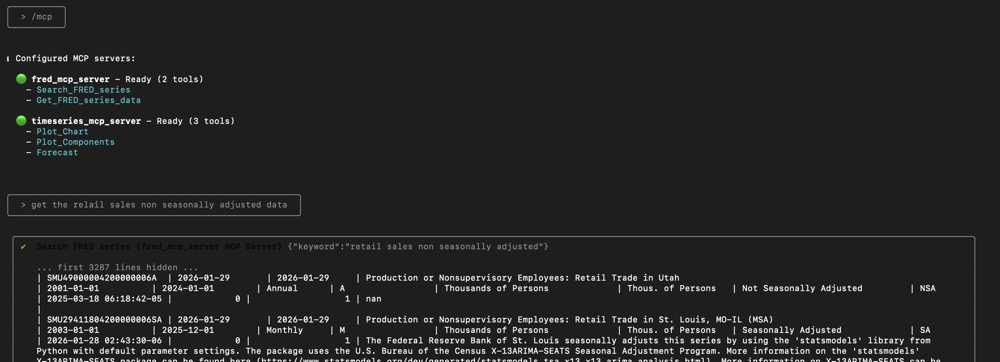
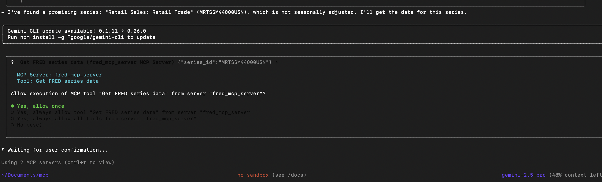
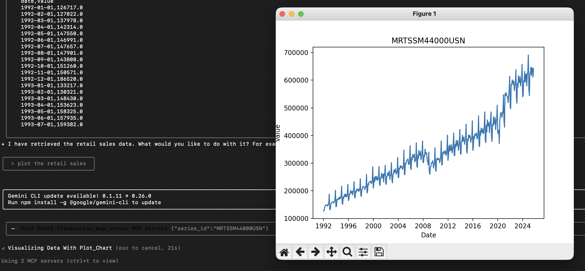
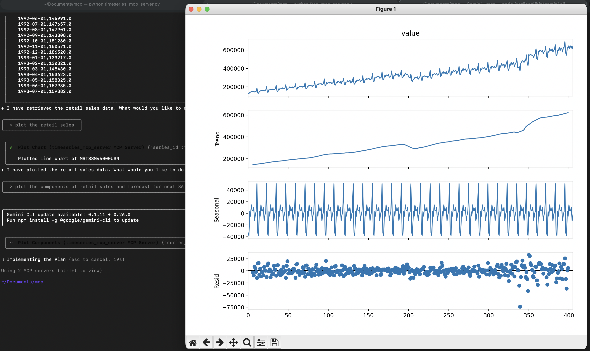
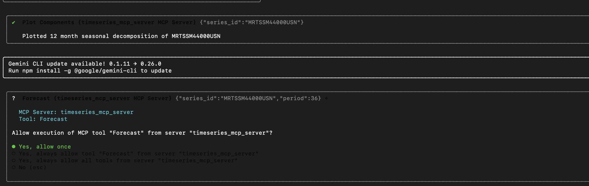
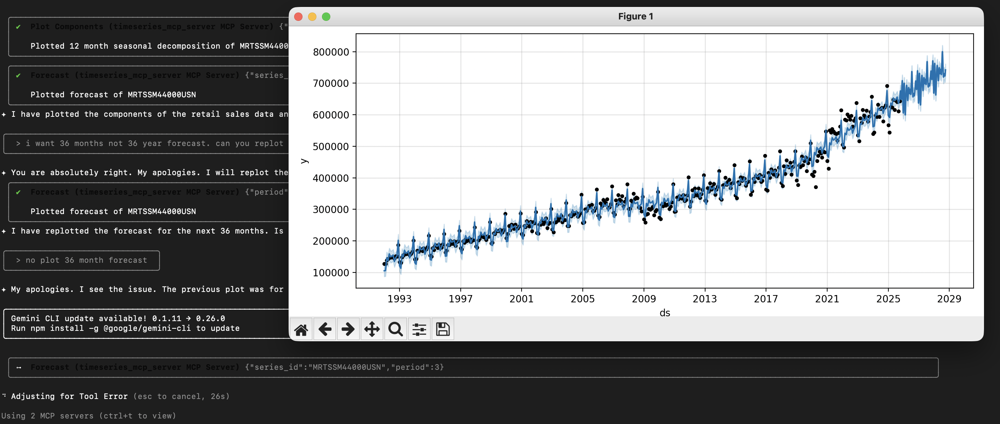

# Economic Data MCP

This project provides FastMCP servers to collect data from FRED servers and do timeseries analysis.

## Installation

- Python with the following libraries: fastmcp, pandas, statsmodels, dotenv, requests, tabulate, matplotlib

```bash
  sudo apt-get update
  sudo apt-get install python3.9

  pip install fastmcp, pandas, statsmodels, dotenv, requests, tabulate, matplotlib
```
    
## Instructions

To start the servers, use the following commands:
Shell 1:
```bash
    python fred_mcp_server.py
```
Shell 2:
```bash
    python timeseries_mcp_server.py
```

## Testing:
Test using gemini cli
```bash
    gemini cli
    /mcp
```


## Screenshots
MCP List

Tool Calling

Ploting line chart

Ploting decomposition

Multistep execution

Forecast



## Authors

- [@nitinappiah](https://nitinappiah.github.io/)


